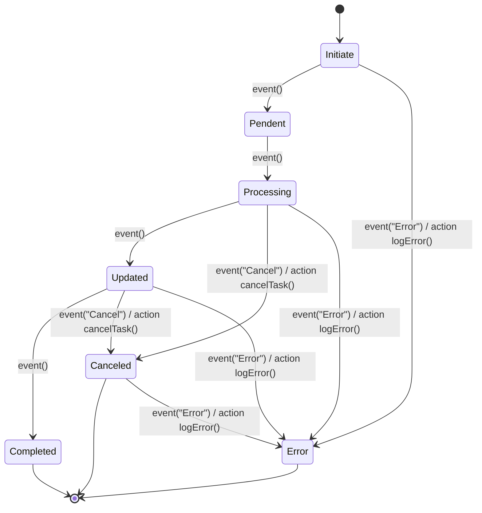

# State Machine Proof of Concept

This project is a proof of concept (PoC) for a state machine for task management in PHP. It implements a set of states and transitions that allow a task to be managed through different stages, such as "started," "pending," "processing," "updated," "completed," "canceled," and "errored."

The state machine is implemented in the **`TaskStateMachine`** class and is composed of a current state, a history of transitions, and information about the current task. Each state is represented by a class that implements the **`State`** interface, with methods to perform state transitions and events associated with each state.

The states implemented in this project are:

- **`Initiate`**: represents the initial state of a task. In this state, the task is started and assigned a unique UUID.
- **`Pendent`**: represents the state of a task that is waiting to be processed by a bot.
- **`Processing`**: represents the state of a task that is being processed by a bot.
- **`Updated`**: represents the state of a task that has been updated by external instances.
- **`Completed`**: represents the state of a task that has been successfully completed.
- **`Canceled`**: represents the state of a task that has been canceled and receives a message indicating the reason.
- **`Error`**: represents the state of a task that has ended in error and receives a message indicating the reason.

Each state can perform state transitions to other states. Additionally, each state has an associated event that can be executed to perform some specific action. For example, the **`event()`** event of the **`Processing`** state updates the information of the bot processing the task.

The project includes a simple example of using the state machine in PHP. In the example, a task is created with the **`Initiate`** state, transitions to the **`Pendent`** state, and then to the **`Processing`** state. When the task is successfully completed, it transitions to the **`Completed`** state. If the task is canceled or ends in error, it transitions to the **`Canceled`** or **`Error`** states, respectively.



## **Using the TaskStateMachine**

There is an example of how to use the **`TaskStateMachine`** to control the state of a "file retrieval" task. I'll explain it line by line:

```php
$dataTask = [
    'task' => 'take_file',
];

$fileExpected =  'file.pdf';
```

Here, an array **`$dataTask`**
is defined with a single element, which is the description of the task to be performed. The name of a file **`$file`**
is also defined, which will be used later on.

```php
$task = new TaskStateMachine($dataTask, new Initiate());
```

In this line, an instance of the **`TaskStateMachine`** class is created, which receives as parameters the **`$dataTask`** array and an instance of the Initiate class. The **`Initiate` class represents the** **`Initiate`** state of the state machine. That is, when the state machine is created, it starts in the **`Initiate` state**.

```php
$task->event()
    ->transitionTo(new Pendent())
    ->event()
    ->transitionTo(new Processing())
    ->event()
    ->transitionTo(new Updated($fileExpected))
    ->event()
    ->transitionTo(new Completed());
```

Here is where transitions between the states of the state machine occur. The **`event()`**
method is used to indicate that a state transition is occurring. Then, the **`transitionTo()`**
method is called, which takes as a parameter the next state that the state machine should assume. This sequence of **`event()`**
and **`transitionTo()`**
calls indicates the sequence of transitions that the state machine should follow. In the example, the sequence is **`Initiate -> Pendent -> Processing -> Updated -> Completed`**

```php
$task->restartState(new Pendent());
```

The **`restartState()`** method takes as a parameter the state in which the state machine should restart. This allows the state machine to be restarted in a state different from the initial state defined when the instance was created. In this example, the state machine is restarted in the **`Pendent`** state.

This method also restores the task as it was when it passed through this method.

```php
var_dump($task->history)
```

Analyzing the **history** parameter of the State Machine, you will see a history of task modifications in each state it passed through.
